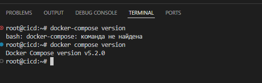
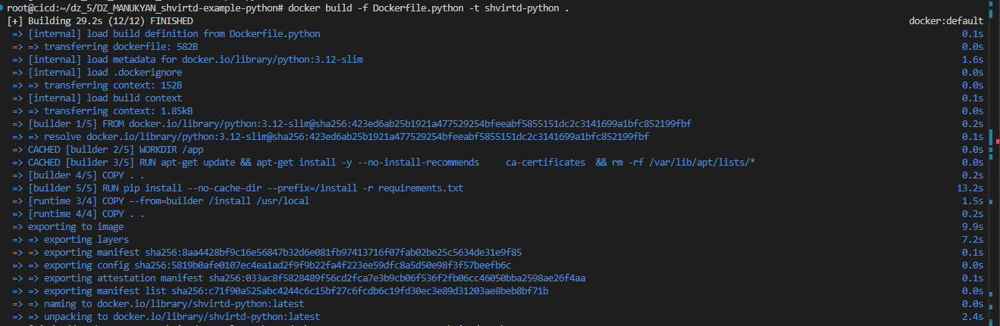
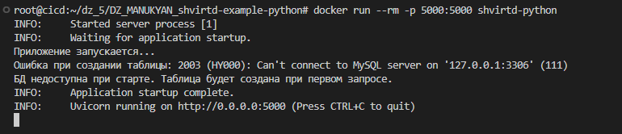
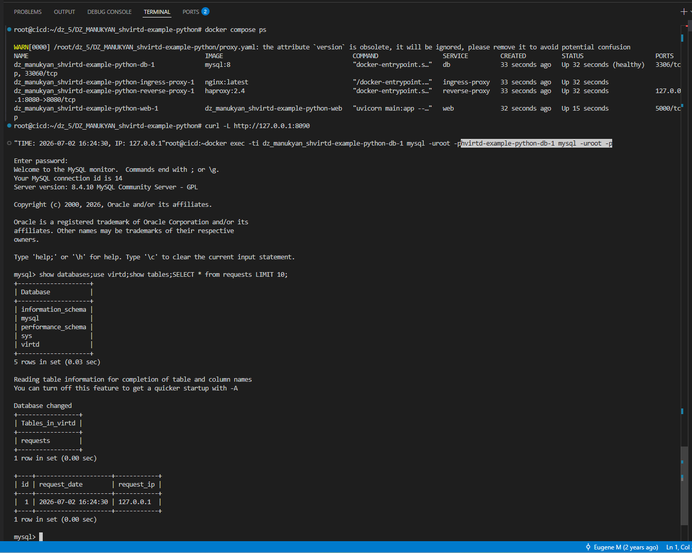

# shvirtd-example-python

Учебный проект FastAPI-приложения для изучения Docker Compose.

## Описание проекта

Это простое веб-приложение на FastAPI, предназначенное для изучения контейнеризации и работы с Docker Compose. Приложение демонстрирует:

- Создание веб-сервиса на FastAPI
- Подключение к базе данных MySQL
- Работу с прокси-серверами (Nginx → HAProxy → FastAPI)
- Корректную настройку сетей Docker
- Передачу IP-адресов через заголовки прокси

### Функциональность

При обращении к главной странице приложение:
1. Определяет IP-адрес клиента
2. Записывает время запроса и IP-адрес в базу данных MySQL
3. Возвращает эту информацию пользователю

**Важно для обучения:** Если обращаться к приложению напрямую (минуя прокси), вы получите подсказку о неправильном выполнении задания.

## Способы запуска

### 1. Запуск через Docker Compose

**Архитектура при запуске через Docker Compose:**
```
Клиент → Nginx (8090) → HAProxy (8080) → FastAPI App (5000) → MySQL
```

### 2. Локальный запуск для разработки

```bash
# Создайте виртуальное окружение
python3 -m venv venv
source venv/bin/activate  # в Windows: venv\Scripts\activate

# Установите зависимости
pip install -r requirements.txt

# Настройте переменные окружения для подключения к БД(не забудьте отдельно запустить БД)
export DB_HOST='127.0.0.1'
export DB_USER='app'  
export DB_PASSWORD='very_strong'
export DB_NAME='example'

# Запустите приложение
uvicorn main:app --host 0.0.0.0 --port 5000 --reload
```

**Требования для локального запуска:**
- Python 3.12+
- Запущенный сервер MySQL
- База данных и пользователь, настроенные согласно переменным окружения

## Настройка базы данных MySQL

```sql
CREATE DATABASE example;
CREATE USER 'app'@'localhost' IDENTIFIED BY 'very_strong';
GRANT ALL PRIVILEGES ON example.* TO 'app'@'localhost';
FLUSH PRIVILEGES;
```

## Доступные эндпоинты

- `GET /` - главная страница (записывает запрос в БД и возвращает время + IP)
- `GET /requests` - просмотр всех записей из базы данных  
- `GET /debug` - отладочная информация о заголовках запроса
- `GET /docs` - автоматическая документация FastAPI (Swagger UI)

## Переменные окружения

| Переменная | Значение по умолчанию | Описание |
|------------|----------------------|----------|
| `DB_HOST` | `127.0.0.1` | Хост базы данных MySQL |
| `DB_USER` | `app` | Пользователь БД |
| `DB_PASSWORD` | `very_strong` | Пароль БД |
| `DB_NAME` | `example` | Имя базы данных |

## Проверка работы

```bash
# При правильной настройке через прокси
curl http://localhost:8090

# При прямом обращении (НЕПРАВИЛЬНО) 
curl http://localhost:5000  
# Получите подсказку о том, что нужно использовать порт 8090
```

## Лицензия

Этот проект распространяется под лицензией MIT (подробности в файле `LICENSE`).
# Практическое применение Docker (Занятие 5)

## Задача 0 — Проверка docker compose


`root@cicd:~/dz_5/DZ_MANUKYAN_shvirtd-example-python# docker-compose --version
bash: docker-compose: команда не найдена
root@cicd:~/dz_5/DZ_MANUKYAN_shvirtd-example-python# docker compose version
Docker Compose version v5.2.0
root@cicd:~/dz_5/DZ_MANUKYAN_shvirtd-example-python#`



## Задача 1 — Dockerfile.python (multistage сборка)

Создан `Dockerfile.python` на базе `python:3.12-slim` с multistage-сборкой.  
Использованы `COPY . .` и `CMD ["uvicorn", "main:app", "--host", "0.0.0.0", "--port", "5000"]`.  
Создан `.dockerignore` для исключения ненужных файлов.

Ссылка на форк [shvirtd-example-python](https://github.com/SavkinILYA/shvirtd-example-python)

Локальный запуск контейнера (без БД — ожидаемая ошибка подключения):

Сборка 


Запуск 


root@cicd:~/dz_5/DZ_MANUKYAN_shvirtd-example-python# curl http://127.0.0.1:5000
Internal Server Errorroot@cicd:~/dz_5/DZ_MANUKYAN_shvirtd-example-python#  
Ошибка т.к нет коннекта с MySQL

Задача 3
Изучите файл "proxy.yaml"
Создайте в репозитории с проектом файл compose.yaml. С помощью директивы "include" подключите к нему файл "proxy.yaml".
Опишите в файле compose.yaml следующие сервисы:
web. Образ приложения должен ИЛИ собираться при запуске compose из файла Dockerfile.python ИЛИ скачиваться из yandex cloud container registry(из задание №2 со *). Контейнер должен работать в bridge-сети с названием backend и иметь фиксированный ipv4-адрес 172.20.0.5. Сервис должен всегда перезапускаться в случае ошибок. Передайте необходимые ENV-переменные для подключения к Mysql базе данных по сетевому имени сервиса web

db. image=mysql:8. Контейнер должен работать в bridge-сети с названием backend и иметь фиксированный ipv4-адрес 172.20.0.10. Явно перезапуск сервиса в случае ошибок. Передайте необходимые ENV-переменные для создания: пароля root пользователя, создания базы данных, пользователя и пароля для web-приложения.Обязательно используйте уже существующий .env file для назначения секретных ENV-переменных!

Запустите проект локально с помощью docker compose , добейтесь его стабильной работы: команда curl -L http://127.0.0.1:8090 должна возвращать в качестве ответа время и локальный IP-адрес. Если сервисы не стартуют воспользуйтесь командами: docker ps -a  и docker logs <container_name> . Если вместо IP-адреса вы получаете информационную ошибку --убедитесь, что вы шлете запрос на порт 8090, а не 5000.

Подключитесь к БД mysql с помощью команды docker exec -ti <имя_контейнера> mysql -uroot -p<пароль root-пользователя>(обратите внимание что между ключем -u и логином root нет пробела. это важно!!! тоже самое с паролем) . Введите последовательно команды (не забываем в конце символ ; ): show databases; use <имя вашей базы данных(по-умолчанию virtd, как это указано в .env)>; show tables; SELECT * from requests LIMIT 10;. Примечание: таблица в БД создается после первого поступившего запроса к приложению.

Остановите проект. В качестве ответа приложите скриншот sql-запроса.



